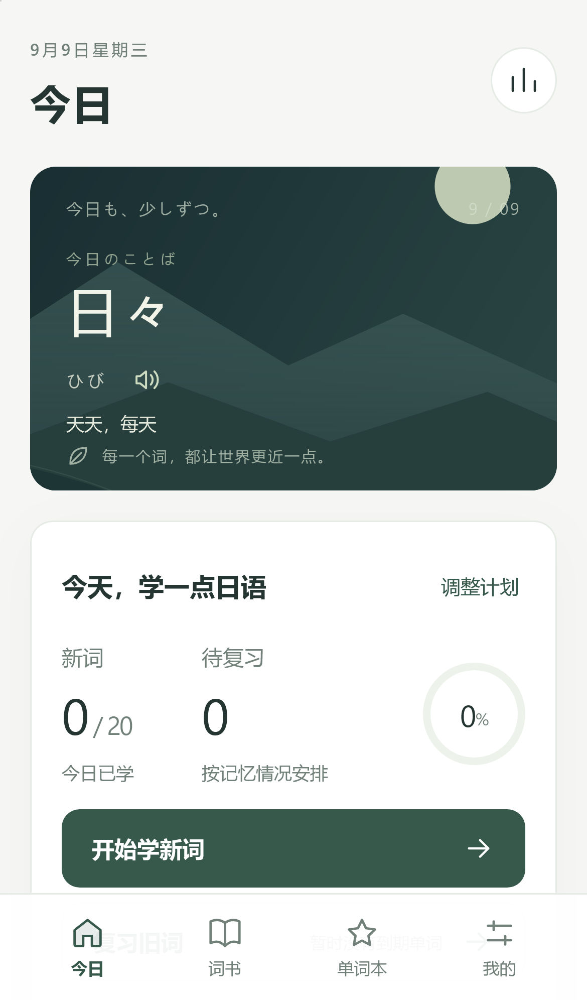
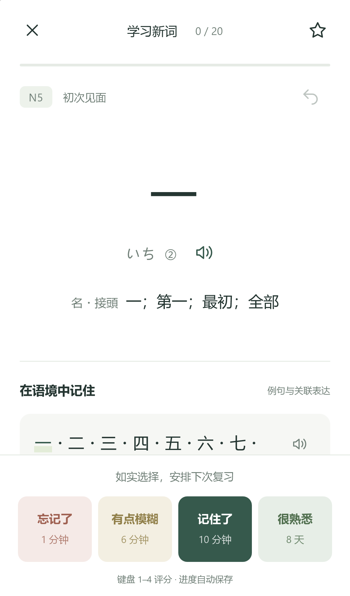

# 言叶 · Kotoba Local

一款面向中文学习者的本地日语背单词 PWA。学习卡片、语境例句和间隔复习，让日语一点点变成日常。可通过 Safari 添加到 iPhone 主屏幕，完成缓存后离线学习。

**应用代码：MIT。内置词库：CC BY-NC 4.0，仅限非商业使用。** 两者的许可独立；代码的 MIT 许可不改变词库的使用条件。

<p>
  
  
</p>

## 功能

- JLPT N5–N1 五本中文词书，共 **10,641 个词条**，含读音、词性、声调标记，以及 **18,191 条例句或关联表达**。
- FSRS 间隔复习、新词随机排列、每日新词目标、到期复习、忘词本轮重现、评分撤销、暂停续学。达到每日目标后，可以继续学习新一组。
- 进入背词卡片自动朗读一次，点击单词区域及留白也可重播；可在设置中关闭自动朗读。
- 听音辨词、假名拼写和背词分别保存进度，切换或重新打开后可接着学；专项练习不改变正式复习计划。拼写答题前不自动发音。
- 104 个清音/浊音/半浊音/拗音组合及读音练习。
- 收藏、笔记、日语/假名/中文搜索、学习统计、夜间模式。
- CSV / JSON 自选词书导入，完整学习记录备份导出与恢复。
- 无账号、广告或跟踪。学习记录存放在当前设备的 IndexedDB；界面及全部词书由 Service Worker 缓存。

语音使用设备的日语语音合成，不包含原牌组的真人音频。离线发音需要先下载系统日语语音；合成音不保证还原词典声调。JLPT 分级采用社区整理，不代表官方完整考纲。

## 本地运行

需要 **Node.js 24+**。Windows 本地 HTTPS 安装向导另需 **Python 3.9+** 和 `cryptography`。

```sh
git clone https://github.com/nono0529/kotoba-local.git
cd kotoba-local
npm ci
python -m pip install -r requirements.txt
npm run build
npm start
```

Windows PowerShell 如受脚本策略影响，可将 `npm` 改为 `npm.cmd`。安装依赖并完成构建后，也可以双击 `启动言叶.cmd`。

启动后在电脑访问 **http://localhost:8765/install**，页面会展示当前网络的手机安装二维码。单纯电脑使用可访问 **http://localhost:8765/**。

如果存在多个 Python 环境，可指定安装了 cryptography 的解释器：

```powershell
$env:KOTOBA_PYTHON = (Get-Command python).Source
npm.cmd start
```

服务器默认使用 HTTP 8765、HTTPS 8443；可通过 `PORT`、`HTTPS_PORT` 修改。不会自动开机启动、修改防火墙或安装任何系统根证书。

## 安装到 iPhone

1. 电脑与手机连接同一 Wi-Fi，保持本地服务运行。
2. 在电脑打开安装向导，用 iPhone 扫码并通过 **Safari** 打开。
3. 按向导安装本机生成的 `Kotoba Local Personal CA` 证书，再到 iPhone「设置 → 通用 → 关于本机 → 证书信任设置」开启该证书的完全信任。
4. 打开向导提供的 **HTTPS 学习地址**，确认没有证书错误。Safari「分享 → 添加到主屏幕」；如有「作为网页 App 打开」，保持开启。
5. **从主屏幕图标重新打开**，到「我的」等待“离线已就绪”。开启飞行模式、关闭再重新打开应用，确认可以查看词书和学习。
6. 完成后电脑可以关机。离线声音需要额外确认系统日语语音已下载。

局域网 HTTP 地址不满足 Service Worker 的安全上下文要求，只添加图标不等于完成离线安装。[Service Worker 说明](https://developer.mozilla.org/en-US/docs/Web/API/Service_Worker_API) · [Apple 证书信任说明](https://support.apple.com/en-ie/102390)

也可以把 `dist/` 部署到自己信任的 HTTPS 静态托管服务；此时不需要本机证书。构建产物要求部署在域名根路径，尚未配置 GitHub Pages 的仓库子路径。不要将整个项目目录作为公开静态文件目录。

## 隐私与备份

- 证书和私钥只在运行时生成到 `.local/certs`；仓库没有预生成证书。**不要上传或分享该目录。** 只信任自己生成的证书，停用后可在手机删除。
- 服务器只提供 `dist/` 公开资源及安装向导的根证书下载；不提供学习记录、私钥、源文件或任意目录浏览。
- 学习记录按设备和访问地址隔离，不自动跨设备同步。推荐安装后直接从主屏幕开始学习。
- 定期在「我的」导出备份到手机“文件”。清理网站数据、卸载主屏幕应用或更换访问地址前，先备份。
- Wi-Fi / DHCP 可能改变电脑 IP。重启服务会更新二维码和服务器证书；旧图标仍可离线使用。换新地址时先在旧图标导出，然后在新地址恢复。长期使用可在路由器保留电脑局域网 IP。
- `.gitignore` 排除了 `.local`、环境文件、证书、日志、安装地址、学习备份及压缩包；提交更改前仍需检查实际暂存内容。

## 连接排查

- 首次安装时电脑和服务都必须运行。手机不能使用 `localhost` 访问电脑。
- 校园网和访客网络可能隔离设备；可以尝试家庭网络或个人热点。
- Windows 防火墙阻止时，可运行 `允许手机连接.ps1`。它会请求管理员权限，仅向本地子网开放 TCP 8765 和 8443；自定义端口时请相应调整。删除规则：`Remove-NetFirewallRule -Name 'Kotoba-Local-iPhone'`。
- 如果 HTTPS 证书报错，核对当前 IP、电脑日期和 iPhone 的完全信任设置，不要仅略过 Safari 警告。
- 没有日语语音时，在 iPhone 辅助功能中搜索“朗读”或“语音”，下载日语并重新打开应用。菜单名称随系统版本变化。

## 开发与验证

```sh
npm run dev
npm test
npm run build
```

开发服务器不启用离线缓存；离线验证请使用正式构建。浏览器检查采用 WebKit 的 iPhone 尺寸设置和桌面 Microsoft Edge：

```powershell
$env:PLAYWRIGHT_BROWSERS_PATH = Join-Path (Get-Location) '.local\browsers'
npx.cmd playwright install webkit
npm.cmd run test:e2e
```

已通过 9 项核心测试与 10 项端到端检查，包括实际停止独立测试服务器、关闭原页面后重新打开，从 Service Worker 缓存恢复词书及进度。WebKit 模拟不等同于 iOS 真机测试；证书安装、主屏幕集成和离线语音仍需在真实 iPhone 上确认。

| 路径 | 作用 |
| --- | --- |
| `src/app.js` / `src/style.css` | 界面与交互 |
| `src/core.js` | FSRS 调度、学习计划、导入与备份校验 |
| `src/storage.js` | IndexedDB 存储 |
| `scripts/server.mjs` | 本地 HTTP/HTTPS 服务与安装向导 |
| `scripts/certificates.py` | 生成本机证书，不自动修改信任设置 |
| `scripts/build-sw.mjs` | 构建全量离线缓存清单 |
| `public/data` | 转换后的词库和来源元数据 |

## 数据来源及许可

词库由 **egg rolls** 制作：[5mdld/anki-jlpt-decks](https://github.com/5mdld/anki-jlpt-decks)，采用 **CC BY-NC 4.0**。本项目将 Anki TSV 转为 JSON，保留日语、简体中文、假名、声调和例句，移除 HTML、音频引用和 Anki 专有字段，按上游排序整理。原数据 SHA-256 与修改说明见 `public/data/provenance.json`，许可全文见 `public/licenses/eggrolls-CC-BY-NC-4.0.txt`。

仓库内的转换后词库可以直接构建使用。若需重新转换，可从上游下载 `deck-source/notes.csv` 和 `LICENSE`，分别保存到本地 `sources/eggrolls/notes.csv`、`sources/eggrolls/LICENSE`，安装 Node 依赖后运行 `python scripts/prepare-data.py`。`sources/` 默认不纳入版本控制；更新上游数据时也应更新来源日期、统计和相关测试。

其他开源依赖：

- [open-spaced-repetition/ts-fsrs](https://github.com/open-spaced-repetition/ts-fsrs)：MIT，复习算法。
- [soldair/node-qrcode](https://github.com/soldair/node-qrcode)：MIT，安装二维码。

原创应用代码、图标与插画采用 [MIT](LICENSE)。言叶是独立项目，与“不背单词”没有关联，不包含其商业素材或会员服务。
